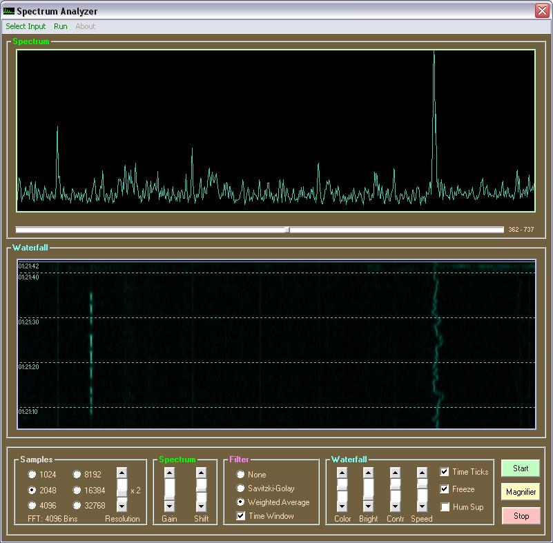



## Spectrum Analyzer \(Major Update \# 2\)

### Description

Gets sound input from the current recording source and displays it as spectrum and as waterfall. Download is 24.1 kB
 
### More Info
 

             |
---                |---
**Submitted On**   |2006-04-11 14:59:30
**By**             |[ULLI](https://github.com/Planet-Source-Code/PSCIndex/blob/master/ByAuthor/ulli.md)
**Level**          |Advanced
**User Rating**    |4.8 (111 globes from 23 users)
**Compatibility**  |VB 6\.0
**Category**       |[Sound/MP3](https://github.com/Planet-Source-Code/PSCIndex/blob/master/ByCategory/sound-mp3__1-45.md)
**World**          |[Visual Basic](https://github.com/Planet-Source-Code/PSCIndex/blob/master/ByWorld/visual-basic.md)
**Archive File**   |[Spectrum\_A1989464242006\.zip](https://github.com/Planet-Source-Code/ulli-spectrum-analyzer-major-update-2__1-65007/archive/master.zip)

